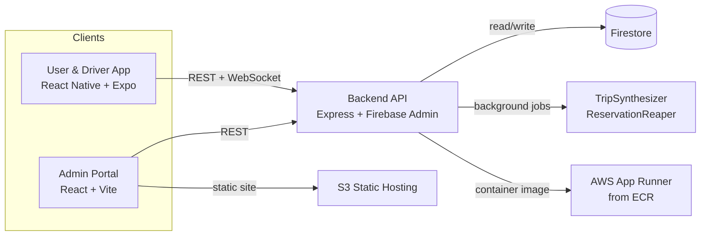

 # TransVahan — Smart CampusTrotter
 
 **CampusTrotter** is a full-stack, real-time campus shuttle platform connecting **Users**, **Drivers**, and **Administrators**.  
 It provides live shuttle tracking, route editing, occupancy analytics, and predictive ETAs — built using Node.js, React, React Native, Firebase, AWS, and Terraform.
 
 ---

## Project Details & Team

* **Course:** DS252 Introduction to Cloud Computing (August 2025 Semester)
* **Team Name:** StormCrafters
* **Git Repository:** https://github.com/sashank-810/CampusTrotter.git

| Team Member | Email ID |
| :--- | :--- |
| **K Bhargav Sashank** | bhargavsk@iisc.ac.in |
| **Y Ratna Sai Aakanksha** | aakankshay@iisc.ac.in |
| **JS Vishnu Teja** | vishnutejas@iisc.ac.in |
| **Kunjan Manoj Kumar S** | manojkumark@iisc.ac.in |

**Acknowledgement:**
This project involved the extensive use of AI agents and coding assistants (such as Claude Opus 4.5, ChatGPT CodeX 5.1 max, Gemini 3 Pro, etc.) for generating boilerplate code, debugging assistance, and clarifying complex API/Cloud configuration steps.
 
 ---

## What TransVahan delivers
- **Automated Live Ops**: Drivers push telemetry; users see buses live with seats and ETAs; admins monitor everything in real time.
- **Role-Based Experience**: Single mobile app with user/driver modes; dedicated admin portal for operations.
- **Data-Driven Insights**: Trip synthesis, reservation aging, analytics/reports endpoints, and alerts keep stakeholders informed.
- **Cloud Native**: Containerized backend on AWS App Runner, static admin portal on S3, Firestore as the single source of truth.

---

## Architecture at a Glance



**How It Fits Together**
- **Clients:** Mobile (user + driver) and Admin portal.
- **Backend API:** Express REST + WebSocket server (App Runner) using Firebase Admin.
- **Data:** Firestore stores auth, routes/stops, vehicles, reservations, alerts, feedback, trip summaries.
- **Jobs:** `TripSynthesizer` builds `trip_summary`; `ReservationReaper` expires stale reservations and broadcasts updates.

**Primary Data Flows**
1) Driver telemetry → `/driver/telemetry` → Firestore → WebSocket `vehicle` broadcasts to mobile/admin UIs (~1.5s).
2) User planner/ETA requests → backend computes from routes/stops/reservations → responds with schedules/ETA summaries.
3) Admin CRUD (drivers/vehicles/routes/assignments/alerts) → backend writes Firestore → emits WebSocket updates to keep UIs in sync.
4) Background jobs → write `trip_summary` and `reservation_update` events → consumed by reports/analytics and live demand indicators.

---

## Key Features

- **User & Driver App (React Native + Expo)**
  - OTP-based signup/login with password reset.
  - Live map with WebSocket vehicle feed, colored lines, and Google Maps-powered search/planner.
  - Stop-aware schedule view, ETA summaries, alerts inbox, and feedback submission.
  - Driver mode for telemetry push, occupancy +/- controls, and viewing active assignments.

- **Admin Portal (React + Vite)**
  - Admin JWT auth, driver CRUD, and vehicle CRUD (capacity/status/route/direction).
  - Route editor and driver-to-vehicle/route assignments.
  - Notifications/alerts creation & resolution.
  - Reports page consuming `/reports/*` (summary, temporal, geo, driver, anomaly, forecast) plus basic analytics.

- **Backend (Node.js + Express + Firestore)**
  - JWT-secured APIs, CORS hardening, and OTP email delivery via Nodemailer.
  - Reservation summaries, ETA endpoints, planner and stop discovery, live telemetry ingestion, and feedback storage.
  - WebSocket broadcasting for vehicles/reservations/alerts; background `TripSynthesizer` and `ReservationReaper`.

- **Infrastructure**
  - Backend container built from `backend/Dockerfile`, pushed to AWS ECR, and run on App Runner.
  - Admin portal hosted from an S3 static website bucket provisioned via Terraform (`infra`).
  - Firebase service account (Firestore) and Google Maps API key configured via `.env`.

---

 ## Project Overview
 
 | Module | Description |
 |--------|-------------|
 | **Backend** | Node.js + Express + Firebase + WebSocket for APIs & live updates |
 | **Admin Portal** | React + Vite dashboard for managing routes, vehicles, and drivers |
 | **User App** | React Native + Expo mobile app (EAS-built APK) |
 | **Infra** | Terraform + AWS (ECR, App Runner, S3 hosting) |
 
 ---
 
 
 ## 1. Prerequisites
 
 Install the following tools (latest stable versions recommended):
 
 | Tool | Purpose | Command |
 |------|----------|---------|
 | **Node.js** (≥ 20) | For backend & frontend builds | `sudo apt install nodejs npm` |
 | **Docker** | For backend containerization | [Install Guide](https://docs.docker.com/get-docker/) |
 | **AWS CLI v2** | To interact with AWS ECR/AppRunner/S3 | [AWS CLI Install](https://docs.aws.amazon.com/cli/latest/userguide/getting-started-install.html) |
 | **Terraform (≥1.6)** | Infrastructure provisioning | `sudo apt install terraform` |
 | **Expo CLI + EAS CLI** | For React Native APK builds | `npm install -g expo-cli eas-cli` |
 | **Git** | Version control | `sudo apt install git` |
 
 ---
 
 ## 2. Repository Setup
 
 ```bash
 # Clone repo
 git clone https://github.com/sashank-810/CampusTrotter.git
 cd CampusTrotter
 
 # 1) Backend env
 cp backend/.env.example backend/.env
 # edit backend/.env and fill real secrets
 
 # 2) Admin portal env
 cp admin-portal/.env.example admin-portal/.env
 # later, set VITE_API_BASE after backend URL is known
 
 # 3) Mobile app env
 cp transvahan-user/.env.example transvahan-user/.env
 # later, set API_BASE_URL + WS_URL after backend URL is known
 
 ```
 
 
 ## 3. Backend Environment Setup
 Generate a JWT_SECRET_KEY
 ```bash
 head -c 32 /dev/urandom | base64
```

 - Create a Firebase Project in the Firebase Console 
 - Go to Project Settings --> Service Accounts --> Generate new private key (Node.js) 
 - Save the downloaded file in ```./backend```
 - Copy the name of the file
   ## Replace the below variables along with the angular brackets
 - Replace all the occurances of `<JWT_SECRET_KEY>` with the generated key from the previous bash command
 - Replace all the occurances of `<GOOGLE_SERVICE_ACCOUNT>` with the name of the file
 - Replace all the occurances of `<EMAIL_ID>` with Your email ID
 - Replace all the occurances of `<EMAIL_PASSWORD>` with your app password (email ID password generated 16 characters)
 - Replace all the occurances of `<PROJECT_ID>` with your project ID present in downloaded file stored in `./backend`
 - Replace all the occurances of `<WE_NEED_THIS>` with your Google Maps API Key
 - Replace all the occurances of `<UNIQUE_BUCKET_NAME>` with your Unique S3 Bucket Name [You have to set this]
 - For cloud deployment, Replace all the occurances of `<REGION>` with the AWS Region you are working
 - For local deployment, Replace all the occurances of `<LOCALHOST_BACKEND_URL>` with `localhost:5001`
 - For local deployment, Replace all the occurances of `<NGROK_BACKEND_URL>` with your NGROK URL which you get by running `ngrok http 5001`
 - For local  deployment, Replace all the occurrances of `http://<UNIQUE_S3_BUCKET>.s3-website.<REGION>.amazonaws.com` with `http://localhost:3001` and `https://<UNIQUE_S3_BUCKET>.s3-website.<REGION>.amazonaws.com` with `https://localhost:3001`


---

## 4. Cloud Configuration (AWS)
 Run the following command in root directory
 ```bash
 
 aws configure
 # Enter your AWS Access Key, Secret, Region (ap-south-1)

```
#### Make sure you attached all the policies that includes S3 bucket operations and ECR repository
or
#### Paste the below AWS Console → IAM → User → Add inline policy → JSON
```json
{
  "Version": "2012-10-17",
  "Statement": [
    {
      "Sid": "ECRRepositoryAndImagePush",
      "Effect": "Allow",
      "Action": [
        "ecr:CreateRepository",
        "ecr:DescribeRepositories",
        "ecr:DeleteRepository",
        "ecr:ListImages",
        "ecr:DescribeImages",
        "ecr:BatchGetImage",
        "ecr:BatchCheckLayerAvailability",
        "ecr:GetDownloadUrlForLayer",
        "ecr:InitiateLayerUpload",
        "ecr:UploadLayerPart",
        "ecr:CompleteLayerUpload",
        "ecr:PutImage"
      ],
      "Resource": "*"
    },
    {
      "Sid": "ECRGetAuthorizationToken",
      "Effect": "Allow",
      "Action": [
        "ecr:GetAuthorizationToken"
      ],
      "Resource": "*"
    },
    {
      "Sid": "S3FullAccessForTerraform",
      "Effect": "Allow",
      "Action": [
        "s3:*"
      ],
      "Resource": "*"
    }
  ]
}

```
Run the following command in root directory
 
 ```bash
 aws ecr create-repository --repository-name <UNIQUE_REPO_NAME>   # Note this repo name for Step 6
 ```


## 5. Infrastructure Deployment (Terraform)
 In ```./infra``` run the below commands
 ```bash
 
 cd infra
 terraform init
 terraform plan
 terraform apply
 
 
 terraform output
 # Note admin_portal_website_endpoint
 
 ```
If you get a “BucketAlreadyExists” error, edit ```./infra/terraform.tfvars``` with a globally unique bucket name and rerun terraform apply.


 ## 6. Build and Push Backend to AWS ECR
 Run the following command in `./backend`
 
 ```bash
 
 # 1) Authenticate Docker with AWS ECR
 aws ecr get-login-password --region ap-south-1 | \
   docker login --username AWS --password-stdin <aws_account_id>.dkr.ecr.ap-south-1.amazonaws.com
 
 # 2) Build the backend Docker image
 docker build -t transvahan-backend:latest .
 
 # 3) Tag the image for your ECR repository
 docker tag transvahan-backend:latest \
   <aws_account_id>.dkr.ecr.ap-south-1.amazonaws.com/<UNIQUE_REPO_NAME>:latest
 
 # 4) Push the image to ECR
 docker push <aws_account_id>.dkr.ecr.ap-south-1.amazonaws.com/<UNIQUE_REPO_NAME>:latest
  
```

## 7. Deploy Backend on AWS App Runner
 - Go to AWS Console → App Runner
 - Create service
 - Choose "Container registry" → "Amazon ECR"
 - Select your uploaded image (<UNIQUE_REPO_NAME>)
 - Port: 5001
 - Deployment: Automatic (to redeploy on image push)
 - Service name: transvahan-backend
 - Allow public access

 The above step will take time to deploy
 
 - Once deployed, note down the service URL (e.g. https://abcdefghi.ap-south-1.awsapprunner.com)
 - This is ur `localhost:5001` 

 - And make sure that what ever u have copied looks like this `abcdefghi.ap-south-1.awsapprunner.com`

 - Replace all the occurances of `LOCALHOST_BACKEND_URL` and `NGROK_BACKEND_URL` with URL you copied 
 
 ### Health Check
 ```bash
 
 `curl -i https://<LOCALHOST_BACKEND_URL>/health` or  `curl -i https://<NGROK_BACKEND_URL>/health`
 # Should Return {"ok": true}
```


 ## 8. Build and Deploy Admin Portal
 In the ```./admin-portal``` run the following commands

 ```bash
 npm install
 npm run build
 
 # Upload to the Terraform-created bucket
aws s3 sync dist/ s3://<UNIQUE_BUCKET_NAME> --delete
```
You can now access your admin portal via the website endpoint printed by Terraform.


 ## 9. Build Mobile App (APK)

 - Create an account in `https://expo.dev/` 
 - The above Credentials will be used in `eas login`
 - Click on Create a Project and set a Display Name and you will get the corresponding SLUG.
 - Copy the Display Name, SLUG and ProjectId you get after creating the project.
 - Paste the above copied info in `transvahan-user/app.config.ts`, precisely, `name: "<PASTE_YOUR_APP_NAME>", slug: "<PASTE_YOUR_APP_SLUG>",` projectId:"<PASTE_YOUR_PROJECT_ID>"

 ```bash
 # Ensure EAS CLI is installed
npm install -g eas-cli

cd transvahan-user
eas login

eas build --platform android --profile production
# answer yes for all questions asked
# A link will be produces with .apk in the end 
# You can download the apk version of the app or you can download it in the next step

 ```

 ## 10. Download and Install the APK

After the build completes, visit the EAS dashboard link printed in your terminal, or list your builds:
```bash
eas build:list
```

Download the .apk, install it on your Android device, and enjoy your working TransVahan app 🚖
 
 ## 11. Local Deployment
    For local deployment of backend, follow the steps below:
    Start running the backend, admin-portal, ngrok, transvahan-user in separate terminal windows
    ```bash
    cd backend
    npm install
    npm run dev or node src/server.js
    ```
    ```bash
    cd admin-portal
    npm install
    npm run dev
    ```
    Forward the backend localhost URL to your ngrok URL to use over any network.
    ```bash
    ngrok http 5001
    ```
    ```bash
    cd transvahan-user
    npm install
    npx expo start --tunnel
    ```
 ## Quick Reference

| Step | Purpose | Command |
|------|----------|----------|
| **Terraform Infra** | Provision AWS resources (S3, IAM, etc.) | `cd infra && terraform apply` |
| **Build Backend** | Build Node.js backend Docker image | `docker build -t transvahan-backend .` |
| **Push to ECR** | Push image to AWS Elastic Container Registry | `docker push <repo_uri>:latest` |
| **Deploy App Runner** | Deploy backend container to App Runner | *Use AWS Console* |
| **Sync Frontend** | Upload built admin portal to S3 | `aws s3 sync dist/ s3://<bucket>` |
| **Build APK** | Build mobile app using Expo EAS | `eas build --platform android` |


---

**Authors:** Team StormCrafters  
**Region:** `ap-south-1`  
**Stack:** Node.js • React • React Native • Firebase • AWS • Terraform  
**Version:** 1.0.0
**App**: CampusTrotter

---
